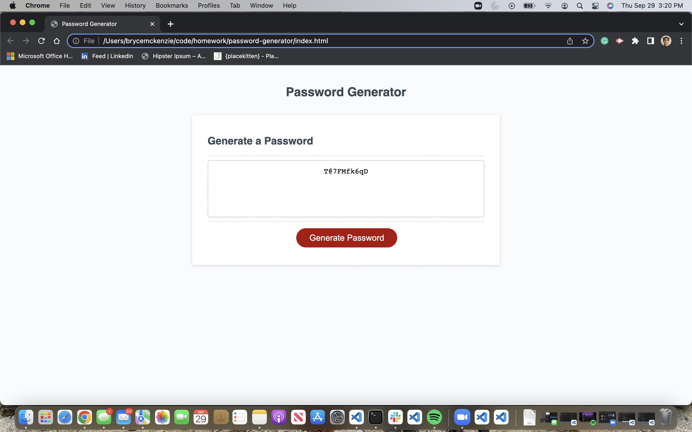

# Professional-Portfolio
This repo is for a password generator where my understanding of JavaSript is applied through an interactive website.

## Description

The purpose of this challenge was to develop an app that runs in the browser and features dynamically updated HTML and CSS powered by JavaScript.

## Installation

N/A

## Usage

To use this website, first click the "Generate Password" button. You will then be prompted to specify how many characters you want your password to be. Once you have input the desired length of your password, click "OK". You will then be asked if you would like to include numbers, special characters, and uppercase letters in your password. Clicking "OK" on any of these prompts will include those characters, while clicking "Cancel" will exclude those characters from your password.

Once you have finished selecting which characters to include, your randomly-generated password will be displayed in the text box.

URL: https://bmckenzie88.github.io/password-generator/

## Credits

N/A

## License

Please refer to the LICENSE in the repo.